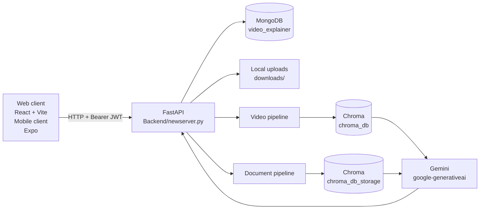

# MultiX architecture

MultiX is a multimodal question-answering application. Its React web and Expo mobile clients call a FastAPI backend, which processes uploaded videos, PDFs, and PowerPoint files, stores session data in MongoDB, and retrieves source context from local Chroma vector stores before asking Gemini for an answer.

## Components

| Area | Location | Responsibility |
| --- | --- | --- |
| Web client | `Frontend/apps/web` | React/Vite UI for sign-in, sessions, upload, and chat. `src/services/api.js` attaches the JWT and calls the FastAPI API. |
| Mobile client | `Frontend/apps/mobile` | Expo/React Native client and authentication/upload helpers. |
| HTTP API | `Backend/newserver.py` | Primary FastAPI application, CORS, JWT-protected endpoints, session management, and ingestion routing. |
| Authentication | `Backend/auth_utils.py`, `Backend/mongo.py` | bcrypt password hashes, JWT creation/validation, and MongoDB user lookup. |
| Video ingestion | `Backend/detect_video_audio.py` | FFmpeg audio extraction, parallel Whisper transcription, YOLO object detection, OCR, and normalized JSON creation. |
| Document ingestion | `Backend/process_ppt.py`, `Backend/pdf_ppt_extract.py` | Aspose converts PowerPoint to PDF; PyMuPDF extracts PDF text and images. |
| Retrieval | `Backend/ingest_and_query_chroma.py`, `Backend/pdf_chroma_ingest.py` | Creates persistent Chroma collections and embeddings for video and document context. |
| Answer generation | `Backend/ExplainX_LLM.py`, `Backend/retrieve.py` | Retrieves relevant chunks and sends composed context to Gemini. |
| Web ingestion | `Backend/web_scrapper.py` | Playwright-based full-page extraction. |
| Telecom experiments | `Backend/telecom` | Separate real-time transcription, voice, Groq, ElevenLabs, and telephony utilities; not part of `newserver.py`'s main request path. |

## Main request flows

### Authentication and sessions

1. The client calls `POST /api/signup` or `POST /api/login`.
2. The backend writes users to MongoDB and returns a JWT after login.
3. Authenticated calls send `Authorization: Bearer <token>`.
4. `POST /api/new-session` creates a MongoDB session document. `GET /api/sessions` and `GET /api/history` retrieve session state.

### Video upload and question answering

1. `POST /api/upload/file` writes the uploaded video to `downloads/`.
2. `detect_video_audio.py` extracts WAV audio with the system `ffmpeg` executable while a worker transcribes it. It also samples frames for YOLO and OCR.
3. A combined JSON result is written under `langbase_json/`.
4. `VectorDB` embeds transcript and frame descriptions into the persistent `chroma_db` video collection.
5. The backend asks `LLM.summarize_video()` and stores the resulting assistant message in the session.
6. `POST /api/ask` routes video questions through video retrieval, then Gemini.

### PDF and PowerPoint upload and question answering

1. `POST /api/upload/file` writes the file to `downloads/`.
2. PowerPoint input is converted to PDF by `Ppt2Pdf`; PDF text and images are extracted into `langbase_json/`.
3. `ChromaMultimodalDB` creates a session-scoped collection named `chat_<session_id>` in `chroma_db_storage`.
4. Text uses `all-mpnet-base-v2` embeddings; images use CLIP embeddings.
5. Document questions retrieve from that session-scoped collection before Gemini generates the answer.

## API surface in `newserver.py`

| Endpoint | Purpose |
| --- | --- |
| `POST /api/signup` | Create a user. |
| `POST /api/login` | Authenticate and receive a JWT. |
| `POST /api/me` | Return the authenticated user. |
| `POST /api/new-session` | Create an empty user session. |
| `GET /api/sessions` | List a user's sessions. |
| `POST /api/upload/file` | Upload and synchronously process a video, PDF, or PowerPoint file. |
| `POST /api/ask` | Ask a question against the session's ingested files. |
| `GET /api/history` | Return messages for a session. |

## Runtime dependencies and infrastructure

- MongoDB is expected locally at `mongodb://localhost:27017`, database `video_explainer`.
- FFmpeg must be installed and available on `PATH` for video audio extraction.
- The application uses local disk for `downloads/`, `frames/`, `temp/`, `langbase_json/`, `chroma_db/`, and `chroma_db_storage/`.
- Embedding and vision models are downloaded through Hugging Face on first use. GPU is used by the video vector pipeline when PyTorch detects CUDA.
- Gemini credentials are loaded through environment variables in the LLM/telecom modules. Keep secret values in a local `.env`, not source control.

## Integration note

The web client exposes an `uploadLink()` method targeting `POST /api/upload/link`, but that endpoint is not present in `Backend/newserver.py`. This is an observed client/server contract gap to resolve before enabling link uploads.
